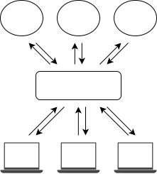

# cloud-compiler

1. Deno をインストールします
   1. なければ入れてください
2. ビルドします
   1. `deno task compile`
3. Docker を立ち上げます
   1. `cd server`
   2. `docker compose up`
   3. `localhost:8000` にサーバーができます
4. テストコードをコンパイルします
   1. `cd test`
   2. `cc-client`
   3. `src/Makefile` が実行されて帰ってきます
   4. `src/main.bin` で実行されるはずです
5. FPGA のツールが入っているので、ビルドできます
   1. Windows からも HTTP を介して実行できます

